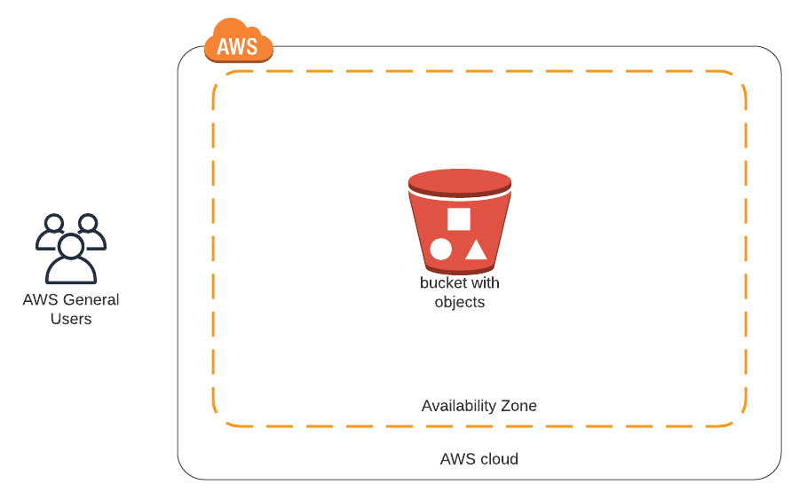

# S3 Website with boto3

Using boto3 - the ASW SDK for python - to host a static website on Amazon S3. Created during "Intro to Cloud DevOps" Udacity Course.

Jupyter notebook s3_website.ipynb contains the python code, which uses boto3

The content of website is stored in wholesale-more-fozen-products directory.
This is a nested directory with files of several different types. 
I created it several year ago, when doing data analysis with R.

#### Why this project

As a Data Scientist, I do care that my projects are running in production, therefore my interest in Data Engineering and DevOps part. I also care, that business-users have access to insights and advanced visualizations that I produce.

Therefore I make those visualizations, including interactive visualizations, with Jupyter notebooks. They are easily converted to HTML files, which can constitute static website. And I host those websites.

AWS S3 is a perfect opportunity to host everything simple and quickly. I am just starting with boto3 and I love it. No mouse-clicking, just python script.

