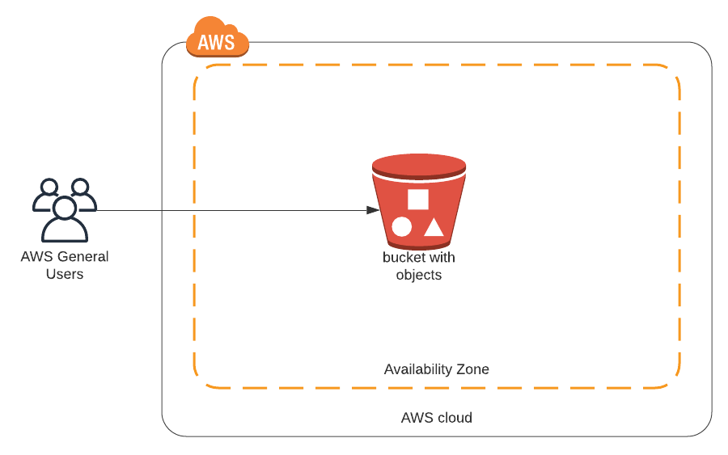

# S3 Webpage with boto3

Using boto3 - the ASW SDK for python - to create a static webpage on S3.

Jupyter notebook s3_webpage.ipynb contains the python code, which uses boto3

The content of website is stored in wholesale-more-fozen-products directory.
This is a nested directory with files of several different types. 
I created it several year ago, when doing data analysis with R.

